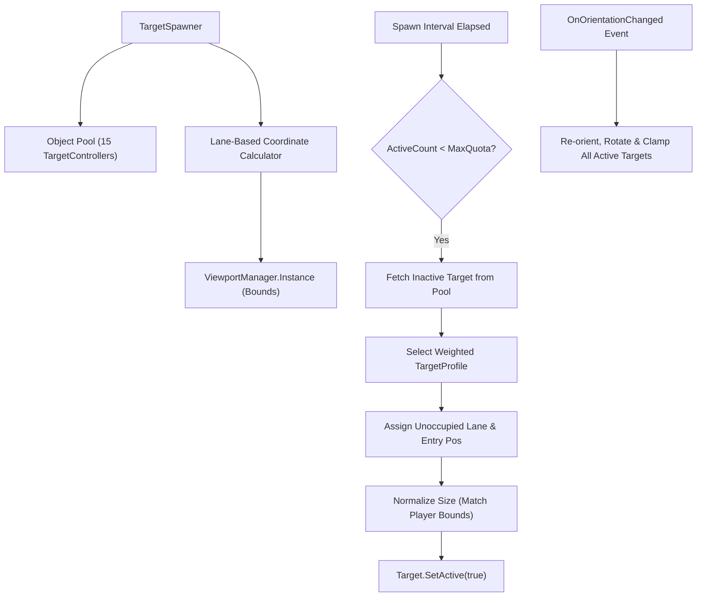

# Phase 3: Object Pooling and Lane-Based Target Spawner

## Overview
Implements a high-performance, zero-allocation `TargetSpawner` with an Object Pool of targets, dynamic concurrency scaling based on score, lane-partitioned anti-clumping spawn coordinates, and full dual-orientation management.

## Requirements
- Functional: Pre-allocate a pool of 15 `TargetController` instances at startup (0 allocations during gameplay).
- Functional: Lane-based anti-clumping: Partition the perpendicular entry axis into discrete lanes and pick unoccupied lanes to prevent sprite overlap.
- Functional: Dynamic difficulty ramp: Scale active target quota (from 1–2 up to 10–15) and spawn frequency as the player's score rises.
- Functional: Dual-orientation resilience: Hook into `GameController.OnOrientationChanged` to update flight axes, rotations, and clamp out-of-bounds targets to the new entry edge.
- Functional: Enforce visual size parity on all spawned birds against Object A (Player) via `ViewportManager.Instance.MatchObjectBounds`.
- Non-functional: Zero GC allocations during continuous spawn and recycle cycles.

## Architecture

## Related Code Files
- Create: `Assets/Scripts/Enemy/TargetSpawner.cs`
- Create: `Assets/Editor/Tests/TargetSpawnerTests.cs`
- Modify: `Assets/Scripts/Core/GameController.cs` (reference and coordinate with `TargetSpawner`)

## Implementation Steps
1. Create `TargetSpawner.cs` in `Assets/Scripts/Enemy/`:
   - Serialize target prefab, pool size (15), array of `TargetProfile` presets, and player reference.
   - Implement `InitializePool()` to instantiate targets with `IsPooled = true` and `SetActive(false)`.
2. Implement Lane Partitioning:
   - In `Horizontal`: Divide `[MinY, MaxY]` into $K$ discrete lanes (e.g. 6–8 lanes).
   - In `Vertical`: Divide `[MinX, MaxX]` into $K$ discrete lanes.
   - Maintain a cooldown or occupancy tracker per lane so successive spawns do not collide.
3. Implement Difficulty Scaling:
   - Method `UpdateDifficulty(int currentScore)` adjusting `maxConcurrentTargets` (starts at 2, caps at 12–15) and `spawnInterval` (from 2.0s down to 0.7s).
4. Implement Dual-Orientation Listener:
   - Subscribe to `GameController.OnOrientationChanged`.
   - Update `isHorizontal` and rotation for all active targets; snap any target outside new bounds to the new entry edge.
5. Create `TargetSpawnerTests.cs` to verify:
   - Pool instantiation and reuse without extra allocations.
   - Lane selection never returns overlapping coordinates within spacing buffer.
   - Active quota enforcement under score progression.

## Success Criteria
- [ ] 15 targets pre-warmed without runtime instantiation.
- [ ] Concurrent targets scale from 2 to 10+ based on score.
- [ ] Simultaneous spawns are visually separated across lanes.
- [ ] Dual-orientation switches adapt all active targets seamlessly.
- [ ] Unit tests pass for pool reuse and lane separation.

## Risk Assessment
- Risk: Changing screen aspect ratio causes targets to spawn in invisible or clipped coordinates.
  - Mitigation: Spawner recalculates lane bounds dynamically using `ViewportManager.Instance` on every spawn.
