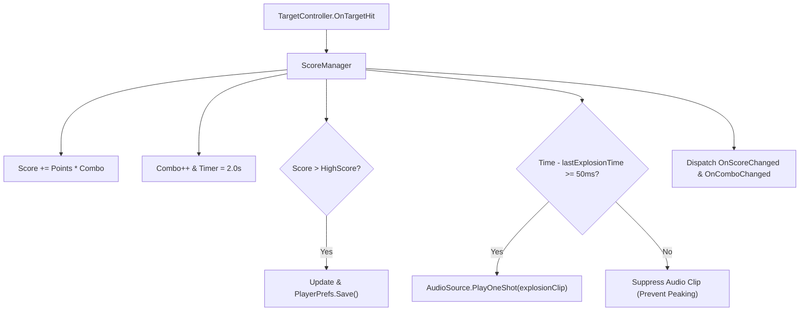

# Phase 4: ScoreManager, Combo System, and Centralized Audio Throttling

## Overview
Implements a decoupled scoring engine that tracks points, dynamic combo multipliers with a decay window, session-persistent high scores via `PlayerPrefs`, and a centralized 50ms audio throttling gate to prevent audio clipping during high-density multi-hits.

## Requirements
- Functional: Score calculation: awards `TargetProfile.PointValue * ComboMultiplier`.
- Functional: Combo system: successive hits within 2.0s increment multiplier (1x, 2x, 3x...); decays back to 1x when the 2.0s window expires without a hit.
- Functional: High score persistence: reads and updates `PlayerPrefs.GetInt("HighScore")`, dispatching an event when a new personal best is reached.
- Functional: Global audio throttling: centralized SFX router enforces a minimum 50ms interval between explosion sounds to prevent clipping during simultaneous multi-kills.
- Non-functional: Events exposed for UI decoupling: `OnScoreChanged`, `OnComboChanged`, and `OnHighScoreChanged`.

## Architecture

## Related Code Files
- Create: `Assets/Scripts/Combat/ScoreManager.cs`
- Create: `Assets/Editor/Tests/ScoreManagerTests.cs`
- Modify: `Assets/Scripts/Core/GameController.cs` (initialize `ScoreManager`)

## Implementation Steps
1. Create `ScoreManager.cs` in `Assets/Scripts/Combat/`:
   - State fields: `CurrentScore`, `HighScore`, `ComboMultiplier`, `ComboTimer`, `ComboDuration = 2.0f`.
   - Audio references: `AudioSource`, `hitClip` (explosion.wav), `comboClip` (eat.ogg), `highScoreClip` (congratulation.wav).
   - Timestamp field: `float lastExplosionSoundTime`.
2. Implement hit listener:
   - Subscribe to `TargetController.OnTargetHit`.
   - Calculate points with multiplier and accumulate `CurrentScore`.
   - Reset `comboTimer = ComboDuration` and increment `ComboMultiplier`.
3. Implement `Update()` loop:
   - If `ComboMultiplier > 1`, decrement `ComboTimer -= Time.deltaTime`. If $\le 0$, reset combo to 1 and fire event.
4. Implement Centralized Audio Throttling:
   - Check `Time.unscaledTime - lastExplosionSoundTime >= 0.050f`.
   - If true, play audio and update `lastExplosionSoundTime`.
5. Implement unit tests in `ScoreManagerTests.cs` to test:
   - Score calculations and combo multiplier ramping.
   - Combo expiration after timer decay.
   - High score persistence through `PlayerPrefs`.
   - Audio 50ms throttle logic.

## Success Criteria
- [ ] Points scale by combo multiplier on rapid hits.
- [ ] Combo timer decays cleanly back to 1x on inactivity.
- [ ] High score persists across game restarts via `PlayerPrefs`.
- [ ] Audio gate suppresses sound overlap within 50ms window.
- [ ] 100% pass on new `ScoreManagerTests`.

## Risk Assessment
- Risk: PlayerPrefs writes on every point gain cause disk I/O hitching.
  - Mitigation: Cache HighScore in memory; write to PlayerPrefs only when surpassing the previous best, with deferred or throttled flush.
