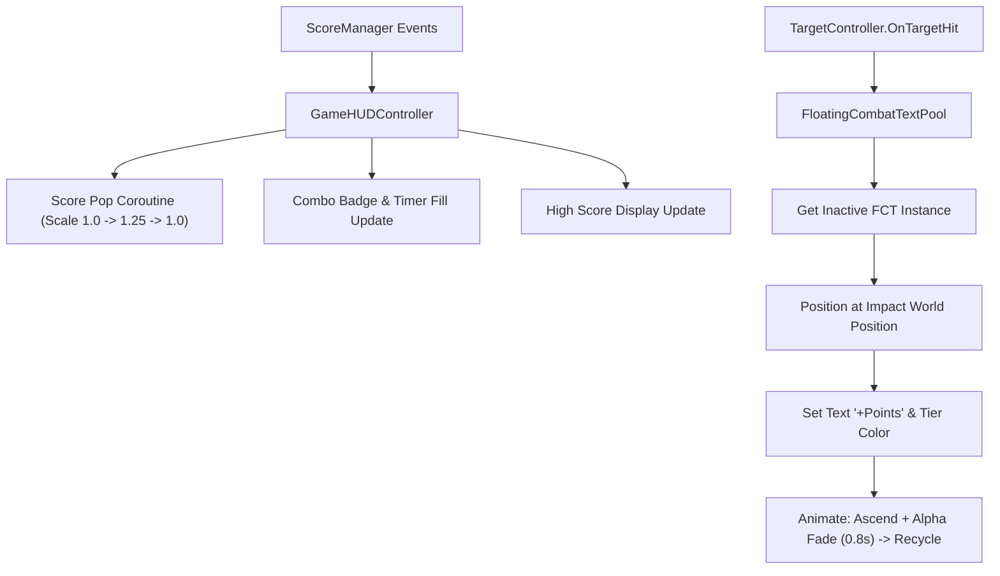

# Phase 5: TextMeshPro HUD and Floating Combat Text System

## Overview
Builds an arcade-grade UI/UX presentation layer featuring a responsive TextMeshPro HUD (Score, High Score, Combo streak with animated pop effects) and an object-pooled World-Space Floating Combat Text (FCT) system that renders juicy, animated score indicators at impact coordinates.

## Requirements
- Functional: Responsive Screen-Space Overlay HUD using TextMeshPro (`font.ttf`) and `CanvasScaler` configured for automatic multi-resolution scaling.
- Functional: Score "pop" animation: Text scales up to 1.25x and smoothly springs back to 1.0x on point gain via a lightweight Coroutine.
- Functional: Combo streak indicator: Displays active combo ("x2 COMBO", "x3 COMBO") with color tier progression and visual timer feedback.
- Functional: High score badge: Anchored Top-Right, persistently displaying the player's personal best.
- Functional: Floating Combat Text: Pre-warmed pool of 20 World-Space Canvas text items that appear at target hit locations, drift upward (+1.5 units), fade alpha to 0 over 0.8s, and return to the pool.
- Non-functional: Zero GC allocations during gameplay (all text instances pre-allocated in pool).

## Architecture

## Related Code Files
- Create: `Assets/Scripts/UI/GameHUDController.cs`
- Create: `Assets/Scripts/UI/FloatingTextController.cs`
- Create: `Assets/Scripts/UI/FloatingTextPool.cs`
- Create: `Assets/Editor/Tests/FloatingTextPoolTests.cs`

## Implementation Steps
1. Create `FloatingTextController.cs`:
   - Contains `TextMeshPro` component and `CanvasGroup` for alpha fading.
   - Method `Play(Vector3 worldPos, string text, Color color, float duration = 0.8f)` executing a Coroutine to lerp position upwards and alpha downwards.
   - On complete, invokes a recycle callback to its pool.
2. Create `FloatingTextPool.cs`:
   - Instantiates a World-Space Canvas with 20 pre-allocated `FloatingTextController` children.
   - Exposes `SpawnFloatingText(Vector3 pos, int points, int comboMultiplier)`.
   - Subscribes to `TargetController.OnTargetHit`.
3. Create `GameHUDController.cs`:
   - Subscribes to `ScoreManager` events (`OnScoreChanged`, `OnComboChanged`, `OnHighScoreChanged`).
   - Implements Coroutine for score number rolling and scale pulse ("pop").
   - Implements combo meter display (colored badges: yellow for 2x, orange for 3x, red/gold for 4x+).
4. Dual-Orientation Verification:
   - Configure Canvas anchors so HUD elements anchor flush against screen safe boundaries regardless of portrait or landscape orientation.
5. Create Unit Tests in `FloatingTextPoolTests.cs` validating pool exhaustion handling, recycling, and positioning math.

## Success Criteria
- [ ] TextMeshPro HUD displays current score, high score, and combo cleanly.
- [ ] Score text pulses with a smooth spring scale animation on every hit.
- [ ] Floating score popups spawn at exact bird impact coordinates and smoothly float/fade.
- [ ] Zero GC allocation during continuous floating text spawning.
- [ ] Layout scales properly in both Horizontal (16:9) and Vertical (9:16) aspect ratios.

## Risk Assessment
- Risk: World-Space canvas text renders behind background or target sprites.
  - Mitigation: Set Canvas sorting layer to "UI" or explicit SortingOrder = 100, above all game sprites.
