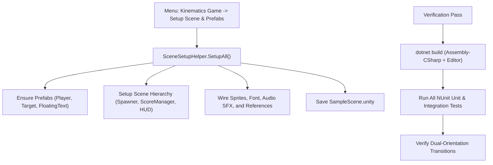

# Phase 6: Scene Setup Automation, Integration, and Dual-Orientation Verification

## Overview
Automates the scene assembly and prefab construction via `SceneSetupHelper.cs`, integrates all managers (`TargetSpawner`, `ScoreManager`, `GameHUDController`, `FloatingTextPool`) into `SampleScene.unity`, and executes comprehensive end-to-end and NUnit regression testing across both game orientations.

## Requirements
- Functional: Update `SceneSetupHelper.cs` to construct and wire all new prefabs, HUD canvas, and spawner objects in one click via `Kinematics Game -> Setup Scene & Prefabs`.
- Functional: Complete integration test suite verifying the multi-target spawning cycle, score accumulation, combo decay, and floating combat text recycling.
- Functional: Dynamic dual-orientation validation: Verify seamless gameplay, boundary wrapping, and lane-based spawning across `GameOrientation.Horizontal` and `GameOrientation.Vertical`.
- Non-functional: 100% pass rate on all legacy and new NUnit test suites. Zero compilation warnings or errors.

## Architecture

## Related Code Files
- Modify: `Assets/Editor/SceneSetupHelper.cs`
- Modify: `Assets/Scripts/Core/GameController.cs`
- Create: `Assets/Editor/Tests/EndToEndScoringIntegrationTests.cs`
- Modify: `Assets/Scenes/SampleScene.unity`

## Implementation Steps
1. Update `SceneSetupHelper.cs`:
   - Create `TargetProfile` assets or runtime catalog for `bird1` through `bird4`.
   - Setup `TargetSpawner` GameObject and assign pool parameters.
   - Setup `ScoreManager` GameObject and wire audio clips (`click.ogg`, `explosion.wav`, `eat.ogg`, `congratulation.wav`).
   - Setup HUD Canvas with `CanvasScaler`, TextMeshPro score/high score/combo labels using `font.ttf`.
   - Setup `FloatingTextPool` in scene.
2. Update `GameController.cs`:
   - Reference `TargetSpawner` and `ScoreManager`.
   - Delegate multi-target orientation and sizing alignment to `TargetSpawner`.
3. Create `EndToEndScoringIntegrationTests.cs`:
   - Test firing a projectile, colliding with a pooled bird, asserting score increment, combo ramp, FCT activation, and target recycling.
   - Test orientation switch mid-game, asserting targets re-align and adapt movement vectors.
4. Run `dotnet build Assembly-CSharp.csproj` and `dotnet build Assembly-CSharp-Editor.csproj`.
5. Execute the full NUnit test suite and record 100% green verification.

## Success Criteria
- [ ] `SceneSetupHelper.SetupAll()` constructs and wires the entire scene without manual editor steps.
- [ ] Multi-target spawning, scoring, combos, and FCT function end-to-end in `SampleScene.unity`.
- [ ] Dual-orientation switching functions without visual glitches or boundary errors.
- [ ] All unit and integration test suites pass with 100% success.

## Risk Assessment
- Risk: Font asset missing TMP Font Asset definition causes pink square glyphs.
  - Mitigation: `SceneSetupHelper` checks for or dynamically creates a TextMeshPro Font Asset from `font.ttf` using `TMP_FontAsset.CreateFontAsset`.
