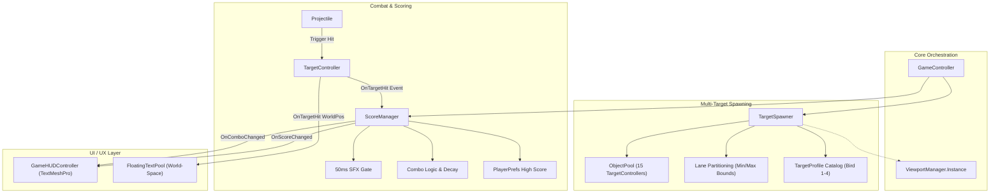

# Multi-Target Spawner, Scoring System, and UI/UX Polish

## Overview
Transforms the 2D kinematics target-shooting game into a dynamic arcade experience. Introduces multi-target concurrent spawning with 4 distinct bird archetypes (`bird1.png`–`bird4.png`), lane-partitioned anti-clumping entry coordinates, dynamic difficulty ramp, a decoupled `ScoreManager` with combo multipliers and `PlayerPrefs` high score persistence, 50ms audio throttling, and a responsive TextMeshPro HUD with World-Space Floating Combat Text (FCT) popups. All changes are strictly additive and backward-compatible with legacy NUnit tests.

## Goals

| # | Goal | Priority |
|---|------|----------|
| 1 | Define 4 distinct bird enemy archetypes with custom speeds, sine wave parameters, points, and rarities | P1 |
| 2 | Additively refactor `TargetController` to support pooled lifecycles, event dispatching, and size parity without breaking existing tests | P1 |
| 3 | Build a zero-allocation `TargetSpawner` with lane-based anti-clumping and score-scaled active concurrency (up to 10–15) | P1 |
| 4 | Implement `ScoreManager` with combo streaks, decay timers, high score persistence, and a 50ms centralized audio throttling gate | P1 |
| 5 | Build responsive TextMeshPro HUD (Score, High Score, Combo) with spring-pop animations and World-Space Floating Combat Text pool | P1 |
| 6 | Automate scene hierarchy assembly via `SceneSetupHelper` and verify 100% pass across all NUnit unit/integration tests | P1 |

## System Architecture

## Phases

| # | Phase | Status | Priority | Effort | Dependencies |
|---|-------|--------|----------|--------|--------------|
| 1 | [Phase 1: Target Profiles and Archetypes](./phase-01-target-profiles-and-archetypes.md) | Complete | P1 | 1h | None |
| 2 | [Phase 2: TargetController Additive Refactor](./phase-02-target-controller-refactor.md) | Complete | P1 | 2h | Phase 1 |
| 3 | [Phase 3: Object Pooling and Lane-Based Target Spawner](./phase-03-object-pooling-and-spawner.md) | Complete | P1 | 3h | Phase 1, 2 |
| 4 | [Phase 4: ScoreManager, Combo System, and Centralized Audio Throttling](./phase-04-scoring-combos-and-audio.md) | Complete | P1 | 2h | Phase 2, 3 |
| 5 | [Phase 5: TextMeshPro HUD and Floating Combat Text System](./phase-05-hud-and-floating-combat-text.md) | Complete | P1 | 3h | Phase 4 |
| 6 | [Phase 6: Scene Setup Automation, Integration, and Dual-Orientation Verification](./phase-06-scene-setup-and-verification.md) | Complete | P1 | 2h | Phase 3, 4, 5 |

## Success Criteria

- [x] 4 distinct bird types spawn with distinct sprites, kinematics, and point values.
- [x] Concurrency scales smoothly up to 10–15 targets without visual clumping or frame drops.
- [x] Zero GC allocations during continuous gameplay loop (all entities pooled).
- [x] Score, combo multiplier, and persistent high score function with snappy audio/visual feedback.
- [x] Floating Combat Text popups ascend and fade cleanly at impact locations.
- [x] Dual-orientation switching (`Horizontal` $\leftrightarrow$ `Vertical`) seamlessly rotates and re-aligns all active targets.
- [x] 100% green pass on all existing and new NUnit editor tests with 0 compiler errors (79/79 passed).

<!-- slug: score-multi-target-spawner -->