# Combat, Audio Management, and Interactive HUD System

## Overview

Transforms `mini-game-2` from a single-weapon shooting prototype into a feature-complete 2D arcade combat game. Introduces an isolated 3-channel `AudioManager` (BGM, SFX pool, Warning siren), orientation-adaptive `RestrictedZoneTrigger` (pulsing 3–6 warning beeps upon enemy breach), in-place UI toggles on a single 64x64 `RectTransform`, a full player combat loadout (Blaster bullets, Homing missiles, Cluster bombs, Energy shield, EMP stun wave), interactive collision handling with Objects X, Y, Z producing 9 distinct gameplay effects, and an expanded TextMeshPro HUD tracking player vitals, currencies, and cooldowns.

## Goals

| # | Goal | Priority |
|---|------|----------|
| 1 | Build 3-channel `AudioManager` (Music, SFX pool, Warning siren) with debounce and `PlayerPrefs` persistence | P1 |
| 2 | Build `AudioToggleButton` supporting in-place sprite swap for Sound and Music toggles with 0px layout drift | P1 |
| 3 | Build orientation-aware `RestrictedZoneTrigger` pulsing 3–6 alarm beeps with 3.0s anti-spam debounce | P1 |
| 4 | Build `PlayerStats` managing HP, Armor, Gold, Diamonds, and dynamic Speed Modifiers with C# events | P1 |
| 5 | Build 3 distinct attack modes (Blaster, Missile, Bomb) and 2 defense skills (Shield, EMP Stun) for Object A | P1 |
| 6 | Build interactive Objects X (Hazard), Y (Supply), Z (Gems) with 9 distinct observable collision effects | P1 |
| 7 | Expand `GameHUDController` with HP, Armor/Shield, Currencies, and Weapon/Skill cooldown indicators | P1 |
| 8 | Automate hierarchy in `SceneSetupHelper` and achieve 100% green pass on all NUnit EditMode unit tests | P1 |

## System Architecture

```mermaid
flowchart TD
    subgraph Audio_Layer ["Audio Management"]
        AM["AudioManager"]
        MS["musicSource (BGM loop)"]
        SFXPool["sfxSourcePool (4 SFX voices)"]
        WS["warningSource (Dedicated Siren)"]
        AM --> MS
        AM --> SFXPool
        AM --> WS
    end

    subgraph World_Perimeter ["Defensive Perimeter"]
        RZ["RestrictedZoneTrigger (20% Viewport)"]
        Enemy["TargetController (Object B)"]
        Enemy -->|Breaches Trigger| RZ
        RZ -->|3-6 Pulses| WS
    end

    subgraph UI_Controls ["HUD Canvas Controls"]
        SToggle["AudioToggleButton (SoundOff ↔ SoundOn)"]
        MToggle["AudioToggleButton (MusicOn ↔ MusicOff)"]
        SToggle -->|Mute SFX| AM
        MToggle -->|Mute Music| AM
    end

    subgraph Player_Subsystem ["Player A (Spacecraft)"]
        PC["PlayerController (Locomotion & Clamping)"]
        PStats["PlayerStats (HP, Armor, Currency, SpeedStack)"]
        PCombat["PlayerCombatSystem (Blaster, Missile, Bomb)"]
        PDef["PlayerDefenseSystem (Shield, EMP Stun)"]
        PCol["PlayerCollisionDispatcher (Trigger Matrix)"]
        
        PC --> PStats
        PC --> PCombat
        PC --> PDef
        PC --> PCol
    end

    subgraph Entities ["Interactive Entities"]
        OX["Object X (Hazard Mine)"]
        OY["Object Y (Tech Supply)"]
        OZ["Object Z (Gem Core)"]
        OX -.->|Collide| PCol
        OY -.->|Collide| PCol
        OZ -.->|Collide| PCol
    end

    subgraph Presentation ["HUD Presentation"]
        HUD["GameHUDController"]
        PStats -->|OnStatsChanged| HUD
        PCombat -->|OnWeaponChanged| HUD
        PDef -->|OnCooldownChanged| HUD
    end

    PCombat -->|Attack SFX| SFXPool
    PDef -->|Defense SFX| SFXPool
```

## Phases

| # | Phase | Status | Priority | Effort | Dependencies |
|---|-------|--------|----------|--------|--------------|
| 1 | [Phase 1: Audio Infrastructure, UI Toggles, and Warning Zone](./phase-01-audio-infrastructure-and-ui-toggles.md) | Pending | P1 | 3h | None |
| 2 | [Phase 2: Player Stats and Dynamic Kinematics Modifiers](./phase-02-player-stats-and-kinematics.md) | Pending | P1 | 3h | Phase 1 |
| 3 | [Phase 3: Offensive Arsenal and Defensive Systems](./phase-03-combat-attacks-and-defenses.md) | Pending | P1 | 4h | Phase 2 |
| 4 | [Phase 4: Interactive Hazards and Extended Player HUD](./phase-04-interactive-hazards-and-hud.md) | Pending | P1 | 3h | Phase 3 |
| 5 | [Phase 5: Scene Setup Automation, Integration, and Verification](./phase-05-scene-setup-and-verification.md) | Pending | P1 | 3h | Phase 1, 2, 3, 4 |

## Success Criteria

- [ ] Audio system manages 3 distinct channels without voice limit starvation during rapid fire.
- [ ] In-place Sound and Music toggle buttons swap sprites on a single 64x64 RectTransform with 0px layout drift.
- [x] Restricted Zone detects Object B entrance and fires 3–6 alarm beeps with 3.0s anti-spam debounce.
- [ ] Object A moves in 4/8 directions with dynamic speed buffs/debuffs clamped to camera viewport extents.
- [ ] 3 attack mechanisms (Blaster, Missile, Bomb) and 2 defense mechanisms (Shield, EMP) function with dedicated cooldowns.
- [ ] Collisions with Objects X, Y, Z reliably execute 9 distinct observable gameplay effects.
- [ ] HUD displays real-time Health, Armor/Shield, Gold, Diamonds, and active weapon/skill status.
- [ ] 100% green pass across all existing and new NUnit EditMode tests with 0 compiler errors.

<!-- slug: combat-audio-hud-system -->
