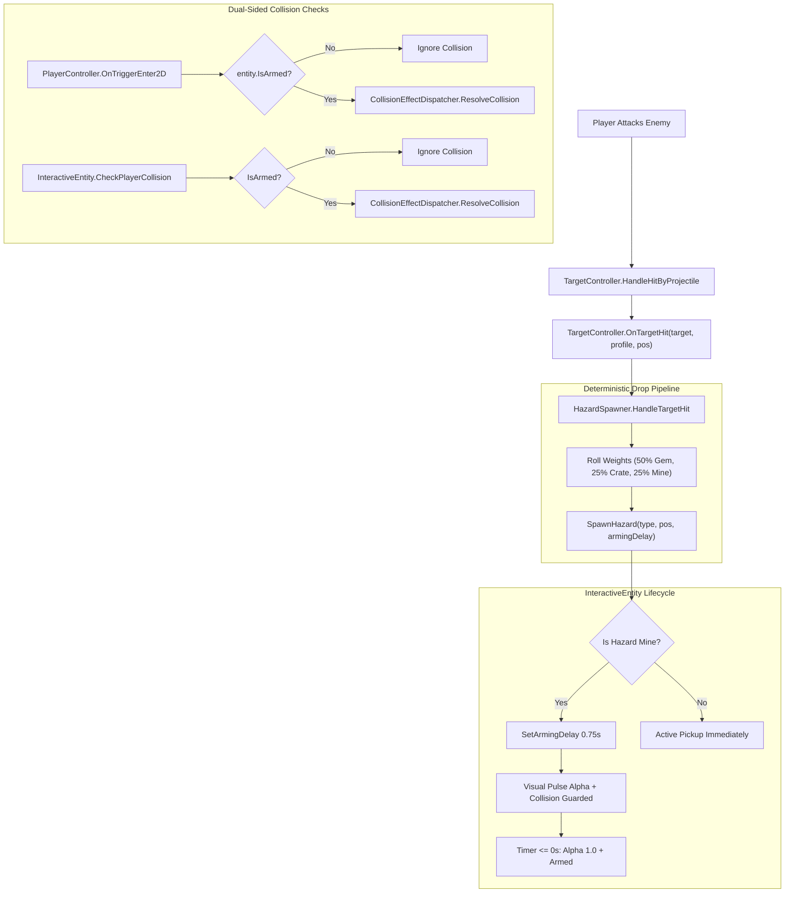

# Combat-Driven Enemy Defeat Drop System

## Overview

Refactors item and hazard generation from an ambient, perimeter-drifting generator into a combat-driven event pipeline. Ambient/periodic map-edge spawning and startup prewarming in `HazardSpawner` are completely disabled. Whenever an enemy target is attacked and taken down by any player weapon (`TargetController.OnTargetHit`), `HazardSpawner` reliably drops one item (50% Gem Core Z, 25% Supply Crate Y, 25% Hazard Mine X) at the exact defeat coordinates. To prevent point-blank kills from instantly detonating on the player, dropped Hazard Mines feature a 0.75-second arming delay with visual warning pulsation.

## Goals

| # | Goal | Priority |
|---|------|----------|
| 1 | Disable passive perimeter/map spawning and prewarming of Objects X, Y, and Z | P1 |
| 2 | Guarantee 100% item drop on enemy takedown at impact coordinates (`OnTargetHit`) | P1 |
| 3 | Rebalance drop distribution to reward-favored (50% Gem, 25% Crate, 25% Mine) | P1 |
| 4 | Implement 0.75s arming grace period on dropped Hazard Mines with visual warning | P1 |
| 5 | Guard both `InteractiveEntity` and `PlayerController` against premature detonation | P1 |
| 6 | Synchronize `SampleScene.unity`, `SceneSetupHelper.cs`, and NUnit EditMode test suites | P1 |

## Phases

| # | Phase | Status | Priority | Effort | Dependencies |
|---|-------|--------|----------|--------|--------------|
| 1 | [Phase 1: InteractiveEntity Arming Delay & Player Guard](./phase-01-start.md) | Completed | P1 | 45m | [] |
| 2 | [Phase 2: HazardSpawner Drop Pipeline & Scene Sync](./phase-02-drop-pipeline.md) | Completed | P1 | 45m | [1] |
| 3 | [Phase 3: Unit Testing & Integration Verification](./phase-03-test-verification.md) | Completed | P1 | 30m | [1, 2] |

## Architecture & Data Flow

## Related Code Files

- Modify: `Assets/Scripts/Combat/InteractiveEntity.cs`
- Modify: `Assets/Scripts/Player/PlayerController.cs`
- Modify: `Assets/Scripts/Combat/HazardSpawner.cs`
- Modify: `Assets/Editor/SceneSetupHelper.cs`
- Modify: `Assets/Scenes/SampleScene.unity`
- Modify: `Assets/Editor/Tests/HazardAndHUDTests.cs`

## Success Criteria

- [x] 0 ambient hazards/pickups spawn during idle flight across 60 seconds.
- [x] 100% of enemy kills spawn an item at `hitPosition` with weights 50% Gem, 25% Crate, 25% Mine.
- [x] Point-blank kills dropping a Hazard Mine do not damage the player during the initial 0.75-second arming window.
- [x] Hazard Mine visual alpha pulses during arming and cleanly restores to 1.0 upon arming completion.
- [x] All tests in `HazardAndHUDTests.cs` and `FullSystemIntegrationTests.cs` pass with zero regressions.

<!-- slug: enemy-defeat-drop-system -->