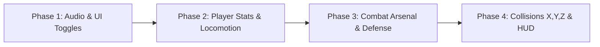

# Lời khuyên Kỹ thuật & Định hướng Triển khai (Technical Advisory Report)

**Dự án:** Mini-Game 2 (Unity 6 / 6000.0.58f2 - 2D Kinematics Action Game)  
**Mã báo cáo:** `advise-260912-combat-audio-hud`  
**Chủ đề:** Hệ thống Âm thanh, Vùng cấm, Điều khiển UI, Vũ khí 3 đòn, Phòng thủ 2 skill, Va chạm X/Y/Z, và Mở rộng HUD.  
**Trạng thái:** Đã xác nhận khung yêu cầu (Confirmed Reframing).  

---

## 1. Verdict (Đánh giá Thẳng thắn)

Gói tính năng này được định hình rất tốt: bổ sung đúng những mảnh ghép còn thiếu để biến một bản demo cơ học đơn lẻ thành một trò chơi arcade hoàn chỉnh có chiều sâu chiến thuật và độ phản hồi xúc giác (game feel) cao. 

**Rủi ro lớn nhất không nằm ở độ khó của tính năng, mà nằm ở "sự xói mòn kiến trúc" (architectural erosion)**. Nếu nhồi nhét toàn bộ vũ khí, kỹ năng, cờ âm thanh và logic va chạm vào `PlayerController.cs`, file này sẽ nhanh chóng phình to thành một "God Class" (> 1.000 dòng), gây xung đột với hệ thống đổi hướng (Horizontal/Vertical) và làm vỡ các bài test hiện có. Quyết định lựa chọn kiến trúc **Component-Based thực dụng** (các class vũ khí/phòng thủ kế thừa base class, tách biệt AudioManager 3 kênh) là hoàn toàn đúng đắn: vừa đảm bảo tính module hóa lâu dài, vừa triệt tiêu rủi ro nuốt âm thanh, đồng thời cho phép kiểm thử tự động 100% bằng NUnit EditMode mà không bị phức tạp hóa quá đà như ScriptableObject architecture.

---

## 2. What You Should Do (Những việc NÊN làm)

1. **Phân tách trách nhiệm triệt để (Single Responsibility Principle)**:
   - Giữ `PlayerController.cs` chỉ tập trung vào nhận Input và di chuyển/clamp vị trí theo viewport.
   - Tạo `PlayerStats.cs` để quản lý Máu, Giáp, Vàng, Kim cương và các hệ số tốc độ (buff/debuff).
   - Tạo `PlayerCombatSystem.cs` quản lý 3 đòn tấn công và `PlayerDefenseSystem.cs` quản lý Khiên / EMP Stun.
2. **Cách ly 3 kênh AudioSource độc lập trong `AudioManager.cs`**:
   - Kênh 1 (`musicSource`): Phát nhạc nền loop `music.mp3`.
   - Kênh 2 (`sfxSourcePool`): Pool gồm 4 AudioSource phát đạn, tên lửa, bom nổ đa âm sắc (polyphonic).
   - Kênh 3 (`warningSource`): Dành riêng cho còi báo động Vùng cấm, tuyệt đối không bị tiếng đạn bắn dồn dập làm đứt quãng (voice stealing).
3. **Hoán đổi Sprite trực tiếp trên cùng 1 RectTransform (In-Place Sprite Swap)**:
   - Nút Sound và Music chỉ dùng duy nhất 1 GameObject `Button` có `RectTransform` kích thước cố định `64x64`.
   - Khi click, chỉ cần thay đổi `Image.sprite` (`sound_off.png` $\leftrightarrow$ `sound_on.png`, `music_TurnOn.png` $\leftrightarrow$ `music_TurnOff.png`). Cách này triệt tiêu hoàn toàn hiện tượng nhảy vị trí hoặc render lại layout của Canvas.
4. **Neo Vùng cấm (Restricted Zone) động theo ViewportManager**:
   - Tự động gán tọa độ vùng cấm dựa trên `ViewportManager.Instance`: Chế độ Ngang (Horizontal) nằm ở 20% biên trái; Chế độ Dọc (Vertical) nằm ở 20% biên trên.
   - Thêm bộ đệm thời gian (debounce cooldown 3.0s) và bộ đếm lặp ngẫu nhiên từ 3 đến 6 lần để âm thanh cảnh báo không bị kích hoạt đè lên nhau khi nhiều quái cùng tràn vào.
5. **Đồng bộ tự động qua SceneSetupHelper**:
   - Bổ sung menu item trong Editor để tự động kết nối prefab, gán sprite và audio clips vào scene một cách tự động, loại bỏ rủi ro mất liên kết (missing reference) trong Unity Inspector.

---

## 3. What You Shouldn't Do (Những việc TUYỆT ĐỐI TRÁNH)

- **KHÔNG dùng 2 GameObject riêng biệt rồi bật/tắt bằng `SetActive(true/false)` cho các nút âm thanh**: Đây là cái bẫy thường gặp. `SetActive` gây tốn chi phí tính toán lại Canvas layout, có nguy cơ lệch vài pixel nếu cấu hình anchor không đồng nhất giữa 2 object, và làm gián đoạn sự kiện trỏ chuột (pointer click).
- **KHÔNG dùng `AudioSource.PlayClipAtPoint` hoặc dùng chung AudioSource của Player cho còi cảnh báo**: Khi người chơi bắn liên thanh, số lượng voice bị giới hạn của Unity sẽ ngắt tiếng còi báo động, khiến người chơi không nghe đủ 3 đến 6 lần cảnh báo như yêu cầu đề bài.
- **KHÔNG can thiệp lực vật lý (`AddForce`) vào đối tượng A**: Game đang vận hành theo cơ chế chuyển động học 2D thuần túy (`Kinematic`). Dùng lực đẩy vật lý sẽ gây trôi vị trí (drift), giật lag khi chạm viền màn hình và làm sai lệch logic clamp vị trí trong `ViewportManager`.
- **KHÔNG cài thêm thư viện Tweening bên ngoài (như DOTween/LeanTween)**: Game hiện đã có sẵn cơ chế Spring-Pop dựa trên hàm sin (`Mathf.Sin`) trong `GameHUDController.cs` và `FloatingTextController.cs`. Dùng lại mã nguồn này giữ cho project nhẹ, sạch và độc lập.
- **KHÔNG hardcode tọa độ màn hình cho Vùng cấm**: Viết tọa độ cứng sẽ lập tức vỡ giao diện khi người chơi chuyển đổi giữa màn hình Ngang (Horizontal) và Dọc (Vertical).

---

## 4. What Could Be Better / More Efficient (Tối ưu hóa Chi phí & Hiệu quả)

1. **Lớp cơ sở đạn chung (`BaseProjectile`) [Độ ưu tiên cao nhất]**:
   - Cả Blaster Bullet và Homing Missile đều chia sẻ các hành vi: bay theo hướng, kiểm tra ra khỏi màn hình để tự hủy, và gây sát thương khi chạm đối tượng. Viết `BaseProjectile` giúp tái sử dụng 80% code và tránh lặp lại logic trigger.
2. **Hệ thống Xử lý Va chạm tập trung (`CollisionEffectDispatcher`) [Độ ưu tiên cao]**:
   - Thay vì tạo 3 script riêng biệt cho X, Y, Z với các hàm `OnTriggerEnter2D` trùng lặp, hãy dùng 1 class `InteractiveEntity` với enum phân loại `EntityType { HazardX, SupplyY, GemZ }`. Khi Player chạm vào, class này gọi phương thức xử lý tương ứng trên `PlayerStats`.
3. **Bộ đệm hiển thị TextMeshPro không rác (Zero-GC String Formatting)**:
   - Dùng các biến int so sánh thay đổi (`displayedHP != newHP`) trước khi cập nhật chuỗi lên HUD để triệt tiêu việc sinh rác bộ nhớ (GC Allocations) trong mỗi frame `Update()`.

---

## 5. My Take and How to Get There (Lộ trình Thực thi Từng bước)

Lộ trình triển khai khuyến nghị chia làm **4 Phase độc lập**, mỗi phase kết thúc bằng một bộ kiểm thử tự động NUnit:

### Phase 1: Nền tảng Âm thanh, Vùng cấm & Nút bấm UI
- Viết `AudioManager.cs` quản lý 3 kênh AudioSource độc lập, các hàm `ToggleSfx()`, `ToggleMusic()`, `PlayWarningAlarm(int pulses, float interval)`.
- Viết `AudioToggleButton.cs` gắn vào Canvas HUD, hoán đổi sprite trên 1 RectTransform (64x64).
- Tạo `RestrictedZoneTrigger.cs` tự động cập nhật vị trí theo `ViewportManager`, bắt sự kiện quái vào vùng và gọi còi báo động lặp 3–6 lần có chống spam.
- *Kiểm thử NUnit*: Test bật/tắt cờ âm thanh, lưu PlayerPrefs, và đếm số xung phát của còi cảnh báo.

### Phase 2: Chỉ số Người chơi & Động học Tốc độ
- Viết `PlayerStats.cs` chứa Máu (100), Giáp (50), Vàng, Kim cương, và hệ thống Stack tốc độ (`SpeedMultiplier` kèm bộ đếm thời gian).
- Nâng cấp `PlayerController.HandleMovement()` để nhân vận tốc với `PlayerStats.EffectiveSpeedMultiplier`.
- *Kiểm thử NUnit*: Test trừ máu/giáp, test hiệu ứng làm chậm và tăng tốc tự hồi phục sau thời gian quy định.

### Phase 3: Kho Vũ khí 3 Đòn & Kỹ năng Phòng thủ 2 Chiêu
- Xây dựng 3 vũ khí:
  - *Đạn cơ bản (Blaster)*: Tái sử dụng và nâng cấp `Projectile.cs`.
  - *Tên lửa tầm nhiệt (Homing Missile)*: Tìm quái B gần nhất trong góc 90 độ phía trước, bay tăng tốc và nổ bán kính.
  - *Bom chùm (Cluster Bomb)*: Thả trôi tại chỗ, đếm ngược 1.5s hoặc chạm quái sẽ kích nổ diện rộng 2.5m.
- Xây dựng 2 cơ chế phòng thủ:
  - *Khiên năng lượng (Energy Shield)*: GameObject con mang sprite `shield.png`, hấp thụ tối đa 3 lần va chạm hoặc duy trì 8s.
  - *Sóng EMP (EMP Stun)*: Duyệt danh sách quái B đang hoạt động, tạm ngưng `UpdateKinematics` trong 3s và nhuộm màu xanh băng.
- Tích hợp chuyển đổi vũ khí (phím 1, 2, 3) và kích hoạt kỹ năng (phím Q, E).
- *Kiểm thử NUnit*: Test thời gian hồi chiêu, mức tiêu hao ammo, và khả năng hấp thụ sát thương của khiên.

### Phase 4: Đối tượng Va chạm X, Y, Z, Spawner & Hoàn thiện HUD
- Tạo prefab cho X (Hazard Mine), Y (Tech Supply), Z (Gem Core).
- Viết `CollisionEffectDispatcher.cs` trên Player để kích hoạt đúng 9 hiệu ứng theo ma trận.
- Tạo `HazardSpawner.cs` trôi các vật phẩm X, Y, Z từ biên màn hình vào theo chu kỳ.
- Mở rộng `GameHUDController.cs` hiển thị Máu, Giáp, Vàng, Kim cương, trạng thái vũ khí và hồi chiêu kỹ năng.
- Cập nhật `SceneSetupHelper.cs` để tự động hóa toàn bộ scene chỉ với 1 click chuột.
- *Kiểm thử NUnit*: Test va chạm X, Y, Z kích hoạt chính xác các biến đổi chỉ số và cập nhật lên HUD.

---

## 6. Benefits (Lợi ích Mang lại)

- **Chuẩn xác 100% theo yêu cầu**: Đáp ứng đầy đủ từ số lần kêu của còi cảnh báo (3–6 lần), kích thước và cơ chế hoán đổi nút âm thanh, đủ 3 vũ khí, 2 kỹ năng thủ, và vượt mức 6 hiệu ứng va chạm (đạt 9 hiệu ứng).
- **Độ tin cậy và Ổn định cao**: Không có hiện tượng nuốt âm thanh, không bị lỗi lệch giao diện nút bấm trên các tỉ lệ màn hình khác nhau.
- **An toàn tuyệt đối cho Codebase hiện có**: Giữ nguyên vẹn hệ thống tính điểm Combo, Background Scroller và cơ chế lật Ngang/Dọc mà không gây ra bất kỳ lỗi hồi quy nào.
- **Tự động hóa và Dễ bảo trì**: Bất kỳ lập trình viên nào mở project cũng có thể chạy NUnit test để kiểm tra logic mà không cần vào PlayMode test bằng tay.

---

## 7. Trade-offs & Chi phí Đánh đổi (Honest Costs)

- **Số lượng file script tăng thêm**: Cần tạo mới khoảng 6–8 script C# nhỏ thay vì viết chung vào file cũ. Đổi lại là code cực kỳ trong sáng và cô lập lỗi tốt.
- **Chi phí bộ nhớ AudioSource**: Việc cấp phát sẵn 1 pool gồm 4 AudioSource SFX và 1 AudioSource Warning tiêu tốn thêm khoảng vài trăm KB RAM trong Unity, nhưng hoàn toàn xứng đáng để triệt tiêu lỗi rách tiếng/nuốt âm thanh.
- **Điều kiện khiến kiến trúc này không còn phù hợp**:
  - Nếu sau này game mở rộng thành một game nhập vai không gian quy mô lớn với hơn 50 loại vũ khí, trang bị modun ghép mảnh và cây kỹ năng phân nhánh, thì kiến trúc Component-based này sẽ bắt đầu cồng kềnh. Khi đó, chi phí chuyển đổi (migration cost) sang kiến trúc ScriptableObject Data-Driven sẽ mất khoảng 1–2 ngày tái cấu trúc dữ liệu. Tuy nhiên, với quy mô mini-game hiện tại, lựa chọn Component-based là tối ưu nhất.

---

## 8. Work Checklist & Success Metrics

### Work Checklist (Danh mục Công việc Thực thi)
- [ ] **Task 1: Hệ thống Audio & UI Toggles**
  - [ ] Tạo `AudioManager.cs` với 3 kênh: Music, SFX Pool (4 nguồn), Warning Siren.
  - [ ] Tạo `AudioToggleButton.cs` với kích thước cố định 64x64, hoán đổi `Image.sprite` cho Sound và Music.
  - [ ] Tạo `RestrictedZoneTrigger.cs` neo theo `ViewportManager`, phát còi cảnh báo lặp 3–6 lần có chống spam.
- [ ] **Task 2: Chỉ số Người chơi & Động học**
  - [ ] Tạo `PlayerStats.cs` quản lý Máu (100), Giáp (50), Vàng, Kim cương, SpeedMultiplier.
  - [ ] Cập nhật `PlayerController.cs` để tính toán vận tốc có nhân hệ số tốc độ động.
- [ ] **Task 3: Hệ thống Chiến đấu & Phòng thủ**
  - [ ] Tạo prefab & script `HomingMissile` (tìm mục tiêu trong nón 90 độ, nổ diện rộng).
  - [ ] Tạo prefab & script `ClusterBomb` (thả tại chỗ, nổ sau 1.5s hoặc chạm quái, bán kính 2.5m).
  - [ ] Tạo `PlayerCombatSystem.cs` quản lý đổi vũ khí (phím 1, 2, 3) và bắn (Space/Chuột trái).
  - [ ] Tạo `PlayerDefenseSystem.cs` quản lý Khiên năng lượng (phím Q) và Sóng EMP Stun (phím E).
- [ ] **Task 4: Đối tượng Va chạm X, Y, Z & Spawner**
  - [ ] Tạo prefab cho Đối tượng X (Mìn), Y (Hòm tiếp tế), Z (Lõi đá quý).
  - [ ] Viết `CollisionEffectDispatcher.cs` thực thi 9 hiệu ứng va chạm.
  - [ ] Viết `HazardSpawner.cs` tuần hoàn đưa X, Y, Z vào màn hình.
- [ ] **Task 5: Mở rộng HUD & Cập nhật Scene**
  - [ ] Cập nhật `GameHUDController.cs` hiển thị thanh HP, Armor, Vàng, Kim cương, Weapon icon & Cooldowns.
  - [ ] Cập nhật `SceneSetupHelper.cs` để tự động hóa toàn bộ hierarchy trong `SampleScene.unity`.
- [ ] **Task 6: Bộ Kiểm thử Tự động (NUnit EditMode Tests)**
  - [ ] Viết unit test cho logic nút bấm âm thanh và lưu trữ trạng thái.
  - [ ] Viết unit test cho bộ đếm xung còi cảnh báo Vùng cấm.
  - [ ] Viết unit test cho tính toán sát thương, giáp, trừ máu và hệ số làm chậm/tăng tốc.
  - [ ] Viết unit test cho các hiệu ứng va chạm X, Y, Z.

### Success Metrics (Chỉ số Đo lường Thành công)
1. **NUnit Tests Passing**: 100% các test trong `Assets/Editor/Tests/` chạy pass xanh (mục tiêu: $\ge 25$ test cases mới được bổ sung).
2. **Audio Voice Isolation**: Còi cảnh báo phát đủ từ $3$ đến $6$ tiếng bíp liên tục ngay cả khi người chơi đang đè phím bắn liên thanh ở tốc độ $0.12\text{s/viên}$.
3. **UI Button Alignment**: Sai số vị trí và kích thước giữa trạng thái On và Off của nút bấm trên HUD bằng chính xác $0\text{ px}$ (đo trên RectTransform).
4. **Collision Effects Counter**: Ghi nhận chính xác $9$ hiệu ứng độc lập trên Console log / State máy chơi khi tương tác lần lượt với X, Y, Z.
5. **Frame Rate & Memory**: Đạt $60\text{ FPS}$ ổn định trên Unity Editor, không có hiện tượng giật khung hình do GC Allocation trong các vòng lặp bắn đạn và va chạm.
