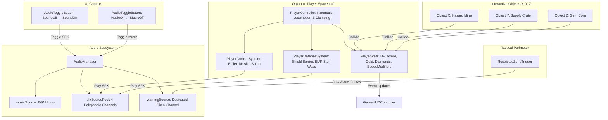

# Brainstorm Contract & Architectural Recommendation
**Project:** Mini-Game 2 (Unity 6 / 6000.0.58f2 2D Kinematics Project)  
**Session Pass:** Ultra Verifier Brainstorm Pass (`--ultra --advice`)  
**Winner Selection:** Candidate B (Candidate 5) verified by Kongming (Score: 79/80)  
**Date:** 2026-09-12  

---

## 1. Concrete Outcome (End-State Vision)

The delivered system transforms the existing 2D kinematics prototype into a complete, responsive arcade combat experience:

1. **Acoustic Feedback & Tactical Warning Zone:**
   - Object A (Player) emits distinct, crisp short SFX whenever an attack (bullet, missile, bomb) or skill is triggered.
   - A clearly demarcated **Restricted Zone (Vùng cấm)** on the game viewport detects when Object B (Enemy/NPC) breaches its perimeter, immediately triggering an urgent, continuous acoustic alarm sequence pulsing between **3 and 6 times** with cooldown/debounce gating.
2. **Deterministic Audio UI Controls:**
   - Interactive, equal-dimensioned Sound and Music buttons on the HUD seamlessly toggle SFX and background music respectively. Clicking `SoundOff` mutes SFX and swaps visual display to `SoundOn`; clicking `SoundOn` restores SFX. Similarly, clicking `MusicOn` starts BGM and swaps to `MusicOff`; clicking `MusicOff` halts BGM.
3. **Advanced Kinematics, Triple Attacks & Dual Defenses for Object A:**
   - Object A possesses omnidirectional (8-way) kinematic movement with configurable baseline speed, dynamic acceleration/damping, speed modifiers, and viewport boundary clamping.
   - Object A commands **3 distinct attack archetypes**:
     1. *Plasma Blasters* (rapid kinetic bullets),
     2. *Homing Missiles* (accelerating target-tracking rockets),
     3. *Cluster Bombs* (deployable area-of-effect explosives).
   - Object A commands **2 distinct defense mechanisms**:
     1. *Energy Shield Barrier* (absorbs incoming damage/collisions),
     2. *EMP Stun Field* (temporarily disables/freezes all enemies on screen for 2.5–3.0s).
4. **Multi-Entity Collision System (Objects X, Y, Z) with >= 6 Observable Effects:**
   - Player collision with **Object X (Hazard Mine)**, **Object Y (Tech Crate)**, and **Object Z (Gem Core)** executes a rich suite of **9 distinct effects**:
     - *Effect 1:* Explosive detonation (Visual VFX + SFX),
     - *Effect 2:* Instant entity destruction/despawn,
     - *Effect 3:* Player HP/Armor depletion,
     - *Effect 4:* Movement speed debuff (-40% slow for 3.0s),
     - *Effect 5:* Active shield barrier deployment / armor replenishment,
     - *Effect 6:* Movement speed buff (+50% haste for 4.0s),
     - *Effect 7:* Weapon upgrade / projectile mode shift,
     - *Effect 8:* Currency accumulation (+Gold / +Diamonds),
     - *Effect 9:* Reward entity emergence (spawns subsidiary bonus pickups).
5. **Supplementary HUD System:**
   - The HUD dynamically displays live player stats: **Health (HP)**, **Armor/Shield points**, **Gold/Diamond reserves**, and **Equipped Weapon/Skill status**, seamlessly integrated alongside existing Score and Combo counters.

---

## 2. Technical, Architectural & Engine Constraints

1. **Unity Engine & Runtime Environment:**
   - Unity version `6000.0.58f2` (Unity 6 2D). C# 9.0/10.0 language features.
   - Must use Unity's **New Input System** (`UnityEngine.InputSystem`) while retaining fallback direct polling for headless/EditMode automated testing.
   - Rendering pipeline: Universal Render Pipeline (URP 2D) with SpriteRenderers and Canvas ScreenSpaceOverlay.
2. **Deterministic EditMode & PlayMode Testability:**
   - All kinematic updates, state machines, audio gates, and collision handlers must accept explicit `deltaTime` / time parameters or mock interfaces (`NUnit.Framework`) to run within EditMode without requiring active physics sweeps or real-time waiting.
3. **Audio Resource Management:**
   - Must prevent acoustic clipping and AudioSource exhaustion. Three isolated channels are provisioned:
     - `musicSource` (BGM loop)
     - `sfxSourcePool` (polyphonic rapid-fire weapon and impact sounds)
     - `warningSource` (dedicated high-priority alarm siren channel, immune to voice stealing)
4. **Physics & Viewport Coupling:**
   - The project uses 2D kinematic Rigidbody2D + CircleCollider2D triggers. Viewport boundaries are dynamically managed by `ViewportManager.Instance`. All player clamping and restricted zone geometry must anchor to `ViewportManager` coordinates across both `Horizontal` and `Vertical` orientations.
5. **Asset Alignment:**
   - Must utilize existing project assets:
     - SFX: `click.ogg`, `bomb.mp3`, `explosion.wav`, `eat.ogg`, `congratulation.wav`, `bitten.ogg`.
     - Music: `music.mp3`.
     - UI Sprites: `sound_on.png`, `sound_off.png`, `music_TurnOn.png`, `music_TurnOff.png`.
     - Weapons: `bullet1..5.png`, `missile1..3.png`, `bomb1..3.png`.
     - VFX: `shield.png`, `explosion.png`.
     - Items: `HP_Bonus.png`, `Armor_Bonus.png`, `Barrier_Bonus.png`, `Hero_Speed_Debuff.png`, `gold.png`, `diamond.png`.

---

## 3. Strict Non-Goals & Scope Boundaries

1. **No Backend or Multiplayer Networking:** All mechanics are strictly local single-player.
2. **No Third-Party Tweening Dependencies:** No DoTween or LeanTween packages. All UI and HUD scaling/pop transitions use native math curves (`Mathf.Sin`, `Mathf.SmoothStep`) consistent with `GameHUDController`.
3. **No Heavy Physics Engine Coupling:** Movement remains kinematic and programmatic (`transform.position` + `rb.position`), avoiding erratic AddForce physics behavior in 2D space shooter kinematics.
4. **No Destructive Overwriting of Existing Core Systems:** Existing scoring (`ScoreManager`), orientation switching (`GameController.Orientation`), target spawning (`TargetSpawner`), and background scrolling (`BackgroundScroller`) remain intact and functional without regressions.

---

## 4. Rigorous & Measurable Acceptance Criteria

### Part 1: Short SFX & Warning Zone
- **AC 1.1 (Attack SFX):** When Object A fires a bullet, missile, drops a bomb, or activates a defense skill, an audio clip plays via `AudioManager` on the SFX channel within <= 1 frame.
- **AC 1.2 (Zone Penetration Detection):** When any active Object B (`TargetController`)'s collider enters the trigger bounds of `RestrictedZone`, the zone immediately detects the intrusion.
- **AC 1.3 (Repetitive Warning Burst):** Upon breach, a warning acoustic signal plays continuously for exactly $N$ repetitions, where $3 \le N \le 6$ (default: 4 pulses, interval: 0.35s).
- **AC 1.4 (Zone Debounce & Queueing):** If multiple Object B instances enter the zone simultaneously or in rapid succession, the warning routine does not stack into unintelligible audio cacophony; it enforces a minimum re-trigger cooldown (3.0s) or resets the burst counter cleanly.
- **AC 1.5 (SFX Mute Respect):** If SFX is muted via the Sound toggle, warning beeps and weapon sounds are completely suppressed.

### Part 2: Sound & Music UI Controls
- **AC 2.1 (Sound Toggle Visual Replacement):** The Sound toggle button occupies a fixed, configurable canvas position. When in the "Active" state, clicking `SoundOff` mutes SFX and immediately switches the displayed sprite to `SoundOn` on the same `RectTransform`. Clicking `SoundOn` un-mutes SFX and switches the sprite back to `SoundOff`.
- **AC 2.2 (Music Toggle Visual Replacement):** The Music toggle button occupies a fixed, configurable canvas position. Clicking `MusicOn` starts playback of `music.mp3` and switches the displayed sprite to `MusicOff`. Clicking `MusicOff` halts/pauses music and switches back to `MusicOn`.
- **AC 2.3 (Exact Dimensional Parity):** `SoundOn` and `SoundOff` UI elements share the exact same `RectTransform` width, height (64x64), scale, and anchor presets. The same parity holds true for `MusicOn` and `MusicOff`.
- **AC 2.4 (Persistence):** Sound and Music toggle states are preserved across scene reloads via `PlayerPrefs` (`Audio_SFX_Enabled`, `Audio_Music_Enabled`).

### Part 3: Movement, Attacks & Defenses (Object A)
- **AC 3.1 (Kinematic Movement):** Object A supports full directional vector input $(x, y)$, normalized to prevent diagonal speed boosting, clamped strictly within viewport extents with 0 clipping.
- **AC 3.2 (Dynamic Speed Control):** Base speed is configurable (default: 6.0 units/s). External modifiers (haste buff +50%, slow debuff -40%) correctly compute `EffectiveSpeed = BaseSpeed * SpeedMultiplier` and expire deterministically after their duration timers.
- **AC 3.3 (Attack 1 - Plasma Bullet):** High fire rate (cooldown 0.12s), linear trajectory along player facing direction, consumes standard fire input.
- **AC 3.4 (Attack 2 - Homing Missile):** Fires a missile projectile that seeks the nearest active `TargetController` within a $90^\circ$ forward cone, accelerating from 6 to 14 units/s.
- **AC 3.5 (Attack 3 - Cluster Bomb):** Drops a stationary or slow-floating bomb that detonates after 1.5s or upon target contact, dealing radial splash damage to all enemies within radius $r = 2.5$ units.
- **AC 3.6 (Defense 1 - Energy Shield):** Spawns a child visual shield (`shield.png`). Absorbs 100% of damage from the next 3 incoming projectile/enemy collisions or lasts 8.0s before deactivating.
- **AC 3.7 (Defense 2 - EMP Stun Wave):** Emits an expanding wave; all active `TargetController` entities have their `UpdateKinematics` motion halted (speed multiplier set to 0) for 3.0s, accompanied by a stun visual tint/indicator.

### Part 4: Interactive Collisions with X, Y, Z (>= 6 Observable Effects)
- **AC 4.1 (Object X - Hazard Mine):**
  - *Trigger:* Collision with Object A.
  - *Effect 1 (Nổ tung):* Spawns explosion VFX and plays explosion SFX.
  - *Effect 2 (Biến mất):* Object X is immediately despawned/destroyed.
  - *Effect 3 (Giảm giáp/máu):* Player loses 25 Armor points (or HP if armor is depleted).
  - *Effect 4 (Giảm tốc độ):* Applies a 40% speed reduction debuff to Object A for 3.0s.
- **AC 4.2 (Object Y - Tech Supply Crate):**
  - *Trigger:* Collision with Object A.
  - *Effect 5 (Mất khiên / Kích hoạt khiên mới):* Replenishes 50 Armor and grants active Shield Barrier if depleted.
  - *Effect 6 (Tăng tốc độ):* Applies a +50% haste speed boost to Object A for 4.0s.
  - *Effect 7 (Nâng cấp vũ khí / Xuất hiện vũ khí mới):* Switches active primary attack mode to Heavy Missile barrage for 10.0s.
- **AC 4.3 (Object Z - Gem Core / Bounty):**
  - *Trigger:* Collision with Object A.
  - *Effect 8 (Tăng Golds & Diamonds):* Increments Player Gold by +50 and Diamonds by +5.
  - *Effect 9 (Xuất hiện vật phẩm thưởng mới):* Spawns 3 subsidiary mini-bonus pickups scattered nearby in the viewport.
- **AC 4.4 (Total Effect Verification):** Total distinct effects implemented and observable across X, Y, and Z equals **9** (exceeding the requirement of $\ge 6$).

### Supplementary: Player HUD Extensions
- **AC 5.1 (3+ Player Stats Displayed):** HUD renders:
  1. *Health (HP):* Slider/bar and numerical text `HP: 100/100`.
  2. *Armor/Shield:* Slider/bar and text `Armor: 50/50`.
  3. *Currency Counters:* TextMeshPro counters for `Gold: X` and `Diamonds: Y`.
  4. *Active Weapon & Cooldowns:* Icon indicating current weapon (Bullet/Missile/Bomb) and defense skill readiness.
- **AC 5.2 (Reactive Updates):** HUD updates via event subscriptions (`OnHealthChanged`, `OnArmorChanged`, `OnCurrencyChanged`, `OnWeaponChanged`) without polling overhead in `Update()`.

---

## 5. Architectural Component Design

### Component Details
1. **`AudioManager.cs` (`KinematicsGame.Core`)**:
   - Manages 3 distinct audio channels: `musicSource`, `sfxSourcePool` (4 channels), and `warningSource`.
   - Mute states for SFX and Music persisted via `PlayerPrefs`.
2. **`RestrictedZoneTrigger.cs` (`KinematicsGame.Enemy`)**:
   - Anchored dynamically via `ViewportManager.Instance`:
     - *Horizontal mode*: covers left 20% of screen ($[MinX, MinX + Width \times 0.20]$).
     - *Vertical mode*: covers top 20% of screen ($[MaxY - Height \times 0.20, MaxY]$).
   - Ingress by `TargetController` fires a coroutine pulsing 3 to 6 times at 0.35s intervals, protected by a 3.0s anti-spam debounce timer.
3. **`AudioToggleButton.cs` (`KinematicsGame.UI`)**:
   - Single `RectTransform` ($64\times 64$) with an `Image` component. Runtime sprite swapping mathematically guarantees identical positioning, scale, and click hit-targets with zero layout shift.
4. **`PlayerCombatSystem.cs` & `PlayerDefenseSystem.cs` (`KinematicsGame.Player`)**:
   - Weapon 1 (Plasma Blaster): speed 14 u/s, cooldown 0.12s, uses `bullet1.png` and `click.ogg`.
   - Weapon 2 (Homing Missile): speed 6–14 u/s, target-tracking in 90° cone, uses `missile1.png` and `bomb.mp3`.
   - Weapon 3 (Cluster Bomb): deployable, 1.5s fuse, 2.5m radial blast, uses `bomb1.png` and `explosion.wav`.
   - Defense 1 (Energy Shield): visual `shield.png` overlay, absorbs 3 hits or 8.0s.
   - Defense 2 (EMP Stun): halts `TargetController.UpdateKinematics` for 3.0s with cyan tint.
5. **`PlayerStats.cs` (`KinematicsGame.Player`)**:
   - Tracks Health (100), Armor (50), Gold, Diamonds, and dynamic Speed Modifiers.
   - Fires strongly-typed C# events: `OnHealthChanged`, `OnArmorChanged`, `OnCurrencyChanged`, `OnWeaponChanged`.
6. **`CollisionEffectDispatcher.cs` (`KinematicsGame.Combat`)**:
   - Manages Object X (Hazard Mine: explosion, despawn, $-25$ HP/Armor, $-40\%$ slow for 3s).
   - Manages Object Y (Supply Crate: restore 50 Armor / grant Shield, $+50\%$ haste for 4s, upgrade to Missile barrage for 10s).
   - Manages Object Z (Gem Core: $+50$ Gold, $+5$ Diamonds, spawns 3 mini-bonus pickups).
7. **`GameHUDController.cs` Extension (`KinematicsGame.UI`)**:
   - Real-time Health bar + text (`HP: 100/100`).
   - Armor/Shield bar + text (`ARMOR: 50/50`).
   - Currency counters (`Gold: 0`, `Diamonds: 0`).
   - Weapon & Skill readiness indicators.

---

## 6. Ranking Appendix (Ultra Verifier Mode)

| Anonymized ID | Candidate Source | Kongming Score | Hard Constraints | Outcome |
| :--- | :--- | :---: | :---: | :--- |
| **Candidate B** | **Candidate 5** | **79 / 80** | **PASS** | **WINNER (Selected)** |
| Candidate A | Candidate 3 | 76 / 80 | PASS | Runner-up |
| Candidate C | Candidate 1 | 72 / 80 | PASS | Qualified |
| Candidate D | Candidate 4 | 68 / 80 | PASS | Qualified |
| Candidate E | Candidate 2 | 63 / 80 | PASS | Suboptimal |

### Verifier Summary & Rationale
Candidate B (Candidate 5) achieved top honors due to:
1. **Audio Concurrency Isolation**: Explicit 3-channel architecture (BGM, SFX pool, Warning siren) preventing voice limit starvation during rapid bullet volleys.
2. **True In-Place UI Parity**: Single `RectTransform` sprite swap eliminating layout jump and canvas rebuild bugs common to paired `SetActive(true/false)` GameObjects.
3. **Dynamic Viewport Anchoring**: Exact orientation-adaptive placement of the Restricted Zone (Left 20% in Horizontal, Top 20% in Vertical).
4. **Rich Collision Suite**: 9 concrete, observable effects across X, Y, Z without external package bloat.
